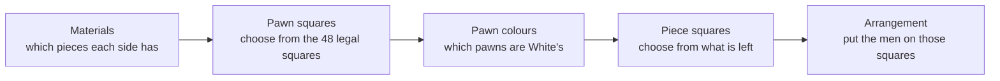

# Chess Upper Bound

An exact upper bound on the number of chess positions, and a general formula for counting the piece combinations it is built on, with an interactive visualization of every part of the formula.

**Live app:** https://aaronliftig.github.io/ChessUpperBound/

**Upper bound: 2.394 × 10<sup>49</sup> positions**, exactly

```
23937533792747905898433845980097921846050276105440
```

A position here is an arrangement of the men on the board.

For comparison, John Tromp estimates the number of legal positions at about 4.8 × 10<sup>44</sup>. That figure is a statistical estimate, made by sampling random positions and checking which are legal, not a proven count. The bound here is proven but much larger, because it keeps many arrangements that could never arise in a game, such as both kings in check.

## Background

This started as an undergraduate project at Florida Gulf Coast University in 2011, "Creating an Upper Bound for the Total Number of Possible Chess Positions", done by hand rather than by computer search. The bound breaks a position into a sequence of choices: how many pawns each side has and where they stand, which pieces are left, where those pieces stand, and in what order.

One part of that bound, the count of which pieces can still be on the board, turned out to generalize neatly. What if chess had five bishops a side, or a dozen piece types? The general version is the first section below. The chess bound is the second.

## Part 1: Counting piece combinations

### The question

A *kind* of piece is a type and colour together, such as "white rook". Each kind has some number of identical copies. How many different collections of pieces can be left on the board, when each kind keeps anywhere from none to all of its copies?

Ignoring kings, pawns and promotions, standard chess has six kinds with two copies (white and black rooks, bishops and knights) and two kinds with one copy (the queens).

### Where the general expression comes from

The original chess bound chose the pieces with this factor:

$$
\sum_{z=0}^{6}\;\sum_{y=0}^{8-z}\binom{6}{z}\binom{8-z}{y}
$$

Here $z$ is the number of kinds kept as a full pair and $y$ the number kept as a single piece. The 6 is the number of kinds that come in pairs. The 8 came from the total: there are 14 pieces (kings and pawns excluded), and $14 - 6 = 8$ is the number of kinds of any size, the six pairs plus the two queens.

That suggests a way to generalize, by writing everything in terms of the total number of pieces $N$ and subtracting. It works for chess, but it gets awkward quickly. For an army with groups of size 1, 2 and 3, the number of kinds is $N - a_2 - 2a_3$, and every further size adds another correction term. The expression needs both $N$ and the group counts, and the pattern behind it is hidden by the bookkeeping.

The generalization below drops $N$ and uses only the group counts. The step that makes it work is seeing that the 8 is not "14 minus 6" but "the number of kinds with at least one copy". Likewise, the 6 is the number of kinds with at least two copies. Writing each level in terms of how many kinds reach that size gives a pattern that extends to any number of sizes, and it makes the proof straightforward. The chess project kept the form with 14 because the total number of pieces was needed elsewhere in the bound, to count the squares those pieces occupy.

### Notation

* $a_j$ is the number of kinds with exactly $j$ copies. Standard chess has $a_2 = 6$ and $a_1 = 2$.
* $A_j = a_j + a_{j+1} + \cdots + a_M$ is the number of kinds with **at least** $j$ copies, where $M$ is the largest number of copies. In chess, $A_2 = 6$ and $A_1 = 8$.
* $i_j$ is the number of kinds that keep exactly $j$ copies in a given combination.

The cumulative counts $A_j$ are the key idea. A kind with $j$ copies can also be thought of as a kind with $j-1$ copies, $j-2$ copies, and so on, once the choices for its larger sizes have been counted. That is why it appears in every level at or below its size.

### The expression

Work down from the largest size. At level $j$, choose which $i_j$ kinds keep exactly $j$ copies. They must come from the $A_j$ kinds that have at least $j$ copies, minus the kinds already used at every higher level:

$$
N \;=\; \sum_{i_M=0}^{A_M}\;\sum_{i_{M-1}=0}^{A_{M-1}-i_M}\cdots\sum_{i_1=0}^{A_1-(i_M+\cdots+i_2)}\;\prod_{j=1}^{M}\binom{A_j-\sum_{k>j} i_k}{i_j}
$$

For chess this is

$$
\sum_{i_2=0}^{6}\;\sum_{i_1=0}^{8-i_2}\binom{6}{i_2}\binom{8-i_2}{i_1} \;=\; 2916.
$$

The empty collection, with nothing left, counts as one combination.

### A worked example

Take both white rooks and the white queen off the board. White keeps its two bishops and two knights; Black keeps everything.

| Level | Kinds available | Chosen | Factor |
|---|---|---|---|
| $j = 2$: kinds kept as a full pair | $A_2 = 6$ | $i_2 = 5$ | $\binom{6}{5} = 6$ |
| $j = 1$: kinds kept as one piece | $A_1 - i_2 = 3$ | $i_1 = 1$ | $\binom{3}{1} = 3$ |

So 18 combinations share this pattern (five kinds kept as full pairs and one kept as a single piece, here the black queen), and this is one of them. The app's "Choosing which pieces are left" section lets you build any combination and shows its term.

### A closed form

The nested sum collapses into a single product:

$$
N \;=\; \prod_{j=1}^{M}(j+1)^{a_j} \;=\; \prod_{j=1}^{M}\left(1+\frac{1}{j}\right)^{A_j}.
$$

The first form says each kind with $j$ copies independently keeps $0, 1, \ldots, j$ of them. The second uses the cumulative counts directly; it equals the first because the exponent of $j+1$ telescopes to $A_j - A_{j+1} = a_j$. For chess, $3^6 \cdot 2^2 = (3/2)^6 \cdot 2^8 = 2916$.

To see why the sum equals the product, collapse the innermost sum with the binomial theorem, $\sum_i \binom{n}{i} r^i = (1+r)^n$, and repeat outward. With two levels:

$$
\sum_{i_2=0}^{a}\binom{a}{i_2}\sum_{i_1=0}^{a+b-i_2}\binom{a+b-i_2}{i_1}
= \sum_{i_2=0}^{a}\binom{a}{i_2}\,2^{a+b-i_2}
= 2^{a+b}\left(1+\tfrac12\right)^{a}
= 3^{a}\,2^{b}.
$$

### Counting by number of pieces

The chess bound needs more than the total: the number of squares to choose depends on how many pieces there are. The generating polynomial keeps that information:

$$
P(x) \;=\; \prod_{j}\left(1+x+x^2+\cdots+x^j\right)^{a_j},
$$

where the coefficient of $x^n$ is the number of combinations with exactly $n$ pieces, and $P(1) = N$. For chess, $P(x) = (1+x+x^2)^6(1+x)^2$, whose coefficients are

```
pieces:  0  1   2   3    4    5    6    7    8    9   10  11  12 13 14
count:   1  8  34  98  211  356  483  534  483  356  211  98  34  8  1
```

### Back to the chess bound

The corrected bound sums over every material each side could have, and that set is built from the same counts. Leave promotions out for a moment and look at one side: its queen, rooks, bishops and knights are three kinds with two copies and one kind with one copy, so the general expression gives $3^3 \cdot 2 = 54$ piece combinations. With 0 to 8 pawns, that makes $9 \cdot 54 = 486$ materials per side, and $486^2 = 81 \cdot 2916$ pairs for both sides, matching the 2,916 combinations above times the pawn choices.

Promotions enlarge each side's choices from 486 to 8,694. Each extra queen, rook, bishop or knight uses up one of that side's missing pawns, so the material sum is the piece-combination count extended by a budget rule: pawns plus promoted pieces is at most 8.

The same reasoning works for armies other than the standard one, which is the question the generalization started from. See [Other games](#other-games) below.

## Part 2: The upper bound on chess positions

### What is counted

Every arrangement of men on the board such that

1. each side has exactly one king;
2. no pawn stands on the first or last rank;
3. each side's material can be reached from the starting army by captures and promotions. A side with $p$ pawns can have at most $8 - p$ promoted pieces, where a promoted piece is any copy beyond the starting count of queens (1), rooks (2), bishops (2) or knights (2).

Every legal position satisfies all three, so the count is an upper bound on the number of legal positions. There are 8,694 possible materials per side, so the sum covers 75,585,636 pairs of materials.

### The formula

For White's material $W$ and Black's material $B$, let $p_W$ and $p_B$ be the numbers of pawns, $n$ the number of kings and other pieces together, and $c$ the size of each group of identical pieces (for example $c = 2$ for a pair of white rooks). Then

$$
N \;\le\; \sum_{W,\,B}\;
\underbrace{\binom{48}{p_W+p_B}}_{\text{pawn squares}}\cdot
\underbrace{\binom{p_W+p_B}{p_W}}_{\text{pawn colours}}\cdot
\underbrace{\binom{64-p_W-p_B}{n}}_{\text{piece squares}}\cdot
\underbrace{\frac{n!}{\prod c!}}_{\text{arrangement}}
$$



Read left to right:

* **Pawn squares.** Pawns can only stand on ranks 2 to 7, which is 48 squares. Choose one square for each pawn.
* **Pawn colours.** Of those squares, choose which ones hold White's pawns.
* **Piece squares.** From the squares left anywhere on the board, choose one for each king and piece.
* **Arrangement.** Put the men on those squares in every order, then divide by the factorial of each group of identical pieces, because two white rooks trading places gives the same position.

For example, with both full starting armies the term, the number of positions with exactly that material, is $\binom{48}{16}\binom{16}{8}\binom{48}{16}\dfrac{16!}{(2!)^6} \approx 2.14 \times 10^{40}$.

### Where the bound is loose

The bound is far above Tromp's estimate of legal positions because it does not rule out:

* positions where the side not to move is in check, or both kings are in check;
* kings on adjacent squares;
* pawn structures that captures could never produce (for example, a side with eight promoted pieces while the opponent still has all its pawns);
* bishops on squares of the wrong colour for the pawns that would have had to promote into them.

Each of these is a possible refinement.

## Other games

The same counting works for any board and army, which is the question the generalization started from: what if chess had more piece types, more copies of each, or a different board? The rules generalize directly. Pawns may stand on any rank except the first and last, so a board with $r$ ranks and $f$ files has $(r-2)f$ pawn squares and $rf$ squares in all. Each side has one king, and extra copies of a piece only come from promoting that side's pawns into piece types that allow it.

$$
N \;\le\; \sum_{W,\,B}\binom{(r-2)f}{p_W+p_B}\binom{p_W+p_B}{p_W}\binom{rf-p_W-p_B}{n}\frac{n!}{\prod c!}
$$

| Game | Board | Army per side, besides the king | Materials per side | Positions at most |
|---|---|---|---|---|
| Standard chess | 8 × 8 | 8 pawns, Q, 2 R, 2 B, 2 N | 8,694 | 2.39 × 10<sup>49</sup> |
| Five bishops a side | 8 × 8 | 8 pawns, Q, 2 R, 5 B, 2 N | 13,842 | 1.60 × 10<sup>54</sup> |
| Capablanca chess | 10 files × 8 ranks | 10 pawns, Q, 2 R, 2 B, 2 N, archbishop, chancellor | 275,022 | 3.66 × 10<sup>67</sup> |
| Los Alamos chess | 6 × 6 | 6 pawns, Q, 2 R, 2 N | 882 | 1.01 × 10<sup>30</sup> |
| Gardner minichess | 5 × 5 | 5 pawns, Q, R, B, N | 1,182 | 7.66 × 10<sup>23</sup> |

These follow the counting rules above, not every detail of each variant. For example, Los Alamos chess forbids promoting to a bishop, which happens automatically here since the army has none.

In the app, the "Design a different game" section has these as presets and lets you set the board size, the number of pawns, and any list of piece types with how many each side has and whether pawns can promote to them. Everything on the page recalculates for that game. In code, pass the same settings to `placementsUpperBound`:

```js
placementsUpperBound({
  rows: 8, cols: 10, pawns: 10,
  army: { Q: 1, R: 2, B: 2, N: 2, A: 1, C: 1 },
  promotions: ["Q", "R", "B", "N", "A", "C"],
});
```

## The app

The app runs entirely in the browser with no build step, and all arithmetic is exact (JavaScript `BigInt`).

* **The formula.** Hover over any part, tap it, or tab to it with the keyboard, and a short description appears with its value for the current material. The board highlights what that part counts in the same colour. Click a part to keep it selected.
* **One material at a time.** Set each side's pawns and pieces and see the value of each factor and their product. The controls only allow materials that captures and promotions can reach, and an unavailable button explains why when you press it. The board shows a random position that the term counts.
* **Design a different game.** Switch games from the menu at the top, or set the board size, the number of pawns, and the list of piece types yourself. Everything on the page recalculates for that game.
* **Piece combinations.** Each kind of piece in the current game is a column; click cells to choose how many remain, and see which term of the nested sum your choice belongs to.

## Repository layout

```
index.html              the app
styles.css
src/counting.js         all of the mathematics, exact BigInt arithmetic
src/app.js              the interface and visualizations
tests/counting.test.js  tests, including brute-force checks
package.json            lets `npm test` run the tests
.github/workflows/      runs the tests on every push
.nojekyll               tells GitHub Pages to serve the files as they are
```

The original Python programs are in the git history.

## Running it

The app uses JavaScript modules, which browsers will not load from a `file://` address, so serve the folder locally:

```sh
python3 -m http.server 8000
# then open http://localhost:8000
```

### Publishing on GitHub Pages

1. Push these files to the `master` branch.
2. In the repository, go to **Settings → Pages**.
3. Under **Build and deployment**, choose **Deploy from a branch**, then select `master` and `/ (root)`.
4. The app appears at `https://aaronliftig.github.io/ChessUpperBound/` after a minute or two.

## Tests

Requires Node.js 18 or later; no packages need to be installed.

```sh
npm test
```

The tests check that

* the formula agrees exactly with brute-force enumeration on small boards, where every arrangement of pieces on every square is generated and filtered by the three rules directly;
* the grouped sum equals the sum over every individual pair of materials, for standard chess and for variants with other boards and unpromotable pieces;
* the fast material count agrees with listing every material one by one;
* the nested sum, the closed form and the generating polynomial agree on hundreds of random armies, and match direct enumeration.

## References

* J. Tromp, ChessPositionRanking, https://github.com/tromp/ChessPositionRanking, which estimates (4.79 ± 0.04) × 10<sup>44</sup> legal positions at 95% confidence by random sampling.
